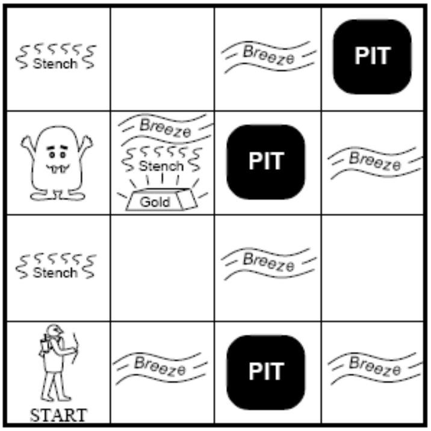

# Wumpus World Simulator for AI4EU



This is a simulator of the Wumpus World intelligent agent environment developed by the Center for Research for Informatics at University of Paris 1 Panthéon-Sorbonne. This simulator is delivered as an asset to the AI4EU platform as part of the verifiable AI research task of the AI4EU H2020 project. Made famous by Stuart Russell and Peter Norvig's seminal texbook Artificial Intelligence a Modern Approach, the Wumpus World is a didactic maze game  providing the simplest possible intelligent agent environment that is still challenging enough to illustrate many key AI concepts.

Our simulator is delivered as containerized REST web service. It accepts http requests from an client agent sending as payload  exploration actions to execute in the Wumpus World. As response it returns  a JSON object containing the percepts of the agent in the new state of the world updated by the consequences of the sent action, together with some additional simulation status information.

The goal of the simulator is to serve an the first building block towards an intelligent agent verification controlled experiment workbench able to check whether a given agent sensing, reasoning and acting in the Wumpus World satisfies some properties such as its ability to reach its goal safely in one specific or all instances of the world. Our Wumpus World simulator is implemented as an Constraint Object-Oriented Logic Program. It is based on Michael Thielscher's fluent calculus for the logical formalization of state change.

# Installation and use

## Prerequisites
At a minimum, you will need a docker environment to launch the image (as all requirements are self-contained in the image). However, for local development, or for launching the server directly without docker you will need SWI-Prolog v8.2.X+ and Logtalk v3.47.X+.

## Running as a docker container
To use the simulator, it is recommended to run it as docker container.  From the main directory of the repository, the quickest way to get the application running (for the first time) is to execute the following make commands:
```
$ make
$ make run
```
The _**make**_ command will build the docker image, and _**make run**_ will run the image that has just been built. To quickly stop the running container run the following command:
```
$ make stop
```
Note that this, and most of the commands in the makefile assume a single running instance of the container at time, which should in general be respected as the server is exposed on a fixed port

### Alternative Run methods
#### Method 1
If you want to observe the initilization sequence of the container, you can run the container with an interactive terminal attached to the process by executing:
```
$ make nba ## If you want to simply run the image
$ make ba ## If you want to first rebuild the image and the run it
```
You can stop the container by performing the Ctrl-C key combination.

#### Method 2
If you want to directly launch the server from Logtalk's top-level, you should do the following:
```
$ swilgt
?- logtalk_load('<repo_location>/src/loader.lgt').
?- server::run.
```

# Interacting with the simulation
Once the server has been succesfully launched (whatever the method), it will be exposed on port 8081. The interaction with the simulator is done through HTTP POST Requests on the following endpoints:

1. **/init** This endpoint creates a new simulation based on the given configuration. It will give you back a unique id for your current session and the initial perceptions of the agent. The structure of the config JSON that need to accompany the request is as follows:
```
{
    "height":<positive-int>,
    "width":<positive-int>,
	"arrow_num":<positive-int>,
	"gold_density":<0..1>, # e.g. 0.05
	"wumpus_density":<0..1>, # e.g. 0.05
	"pit_density":<0..1> # e.g. 0.2
}
```
2. **/forward** A message to this endpoint has the effect of moving you character forward one square. The JSON object that must accompany it (and that of all the other action endpoints) is:
```
{
  "uuid":"<your-unique-id-goes-here>"
}
```
3. **/shoot** This makes the agent fire an arrow (**NOTE**: Firing with no arrows has no effect)
4. **/right** This turns the agent to the its right
5. **/left** This turns the agent to the its left
(**NOTE**: The character basically can only face in one of 4 possible directions north/south/east/west, so the action of turning makes it take the next direction from that list of possibilities).
6. **/grab** This makes the agent attempt to grab the gold (**NOTE**: Trying to grab the gold when you are not on it has no effect)
7. **/climb** This makes the agent attempt to climb out of the cave (**NOTE**: Trying to climb out when not at the exit has no effect)
8. **/halt** This stops the simulation before completion. This also has the same message structure as the actions.

(**NOTE**: There is also a **/debug** endpoint that will always create the simulation environment seen in the image above).

